# Pendahuluan

Sejak tahun 1970, **Structured Query Language (SQL)** telah digunakan oleh para programmer untuk membangun dan mengakses **Sistem Basis Data (SBD)**. Banyak sekali perdebatan mengenai cara penyebutan SQL ini, namun pada kenyataannya, kita dapat melafalkannya sebagai “sequel” ataupun “S.Q.L”. Mempelajari bahasa pemrograman umum seperti R adalah penting dan akan lebih baik jika memiliki kemampuan SQL dalam bidang pengolahan data. 

```{r user-SQL,echo=FALSE, fig.cap='Beberapa Perusahaan Besar Pengguna SQL', tidy=FALSE, out.width='100%', fig.align='center'}
library(knitr)
include_graphics("./images/Bab1/SQL.png")
```

Banyak perusahaan besar di bidang teknologi menggunakan SQL seperti Uber, Netflix, dan Airbnb. Bahkan dalam perusahaan seperti Facebook, Google dan Amazon, yang telah membuat sendiri **SBD** berkemampuan tinggi, tetap menggunakan SQL untuk melakukan query dan analisis data.


## Apa itu SBD?

Secara umum **SBD** dapat didefinisikan sebagai berikut:

```{r SBD,echo=FALSE, fig.cap='Definisi Sistem Basis Data', tidy=FALSE, out.width='100%', fig.align='center'}
library(knitr)
include_graphics("./images/Bab1/definisi_DB.png")
```


### Komponen SBD

Adapun beberapa komponen dasar yang diperlukan dalam SBD adalah:

```{r komponen,echo=FALSE, fig.cap='Komponen SBD', tidy=FALSE, out.width='100%', fig.align='center'}
library(knitr)
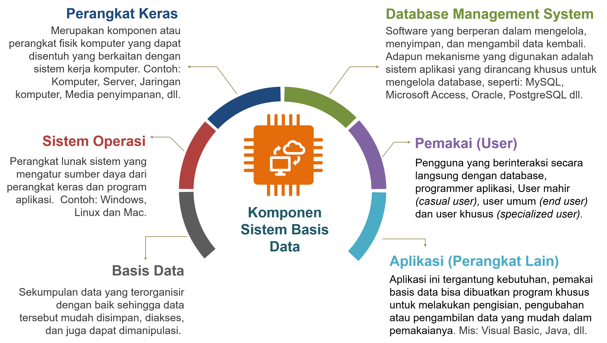
```

***

### Manfaat SBD

Manfaat atau kegunaan penerapan SBD cukup banyak dan cakupannya pun luas dalam mendukung keberadaan lembaga atau organisasi maupun perusahaan, diantaranya:

```{r manfaat,echo=FALSE, fig.cap='Manfaat SBD', tidy=FALSE, out.width='100%', fig.align='center'}
library(knitr)
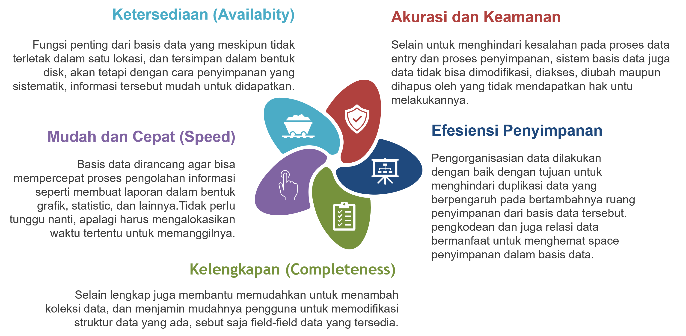
```

***

### Definisi SQL vs NoSQL

Sebenarnya perbedaan antara [SQL](https://www.dewaweb.com/blog/sql-pengertian-fungsi-beserta-perintah-dasarnya/) dan [NoSQL](https://aws.amazon.com/id/nosql/) secara mendasar sudah dapat dijelaskan dari akronimnya. 

```{r SQLvsNoSQL,echo=FALSE, fig.cap='SQL vs NoSQL', tidy=FALSE, out.width='100%', fig.align='center'}
library(knitr)
include_graphics("./images/Bab1/SQLvsNoSQL_DB.png")
```


*SQL* basis data relasional yang menggunakan ‘relasi’ (yang biasanya disebut tabel) untuk menyimpan data dan mencocokkan data tersebut dengan memakai karakteristik umum di setiap dataset. Sedangkan, *NoSQL* adalah database yang menggunakan format JSON untuk setiap dokumennya sehingga mudah dibaca dan dimengerti. NoSQL banyak diminati karena memiliki performa yang tinggi dan bersifat non-relasional sehingga dapat memakai berbagai model data. 

***

### Perbedaan SQL vs NoSQL

Sebenarnya banyak perbedaan yang dimiliki di antara dua database tersebut tapi inilah perbedaan yang paling mencolok antara SQL dan NoSQL:

```{r Perbedaan,echo=FALSE, fig.cap='Perbedaan SQL vs NoSQL', tidy=FALSE, out.width='100%', fig.align='center'}
library(knitr)
include_graphics("./images/Bab1/Perbedaan_DB.png")
```

***

### Top 7 SQL

Tercatat sampai bulan Februari 2020 ada 334 jenis database menurut db-engines.com. Berikut ini saya merangkum daftar 7 database terpopuler yang menggunakan [SQL](https://qwords.com/blog/database-terpopuler/) (Relasional):


```{r top7SQL,echo=FALSE, fig.cap='Top 7 Perangkat Lunak SQL', tidy=FALSE, out.width='100%', fig.align='center'}
library(knitr)
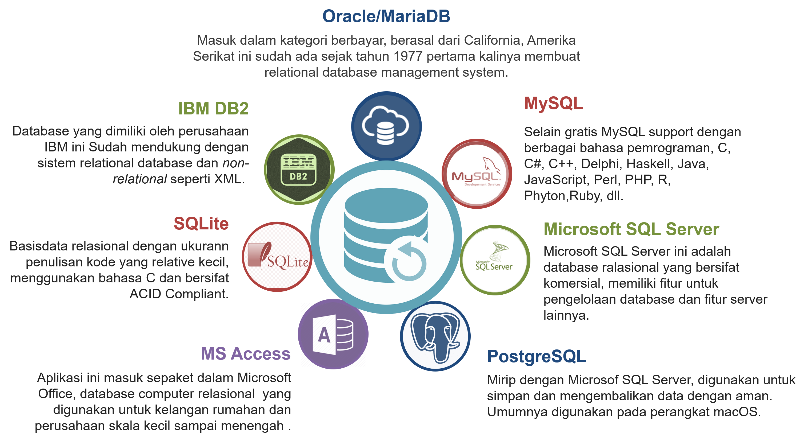
```


***

### Top 8 NoSQL 

Kebanyakan basis data NoSQL digunakan dalam dunia aplikasi web waktu nyata (real-time web app). Berikut ini adalah ulasan 8 jenis basis data [NoSQL](https://www.codepolitan.com/7-basis-data-nosql-populer) yang paling populer digunakan diseluruh dunia: 

```{r top8noSQL,echo=FALSE, fig.cap='Top 8 Perangkat Lunak NoSQL', tidy=FALSE, out.width='100%', fig.align='center'}
library(knitr)
include_graphics("./images/Bab1/8NoSQL_DB.png")
```

***

## Mengapa R & SQL?

Menggunakan R dan SQL merupakan kombinasi yang kuat untuk analisis data dan pengelolaan basis data. Keduanya memiliki peran yang berbeda dalam proses analisis dan pengelolaan data. Berikut adalah beberapa alasan mengapa menggunakan R dan SQL bersama:

* **Kekuatan Analisis R**

R adalah bahasa pemrograman yang khusus dirancang untuk analisis statistik dan visualisasi data.
R memiliki berbagai paket (packages) yang menawarkan fungsi statistik dan analisis yang kuat, termasuk regresi, pengelompokan, analisis deret waktu, dan banyak lagi.
Visualisasi yang dapat dihasilkan dengan R sangat bervariasi, dari grafik sederhana hingga visualisasi interaktif yang kompleks.

* **Manipulasi dan Pengelolaan Data dengan SQL**

SQL digunakan untuk mengelola dan mengambil data dari basis data terstruktur.
SQL menyediakan cara efisien untuk membuat, mengubah, menghapus, dan memanipulasi data dalam basis data.
SQL memiliki fitur untuk menggabungkan data dari berbagai tabel, melakukan agregasi, dan menyaring data.

* **Integrasi Antara R dan SQL**

Banyak perpustakaan R yang mendukung koneksi ke basis data menggunakan SQL.
Anda dapat menggunakan perintah SQL dalam skrip R untuk mengambil data dari basis data, memanipulasi data di dalam R, dan kemudian menerapkan analisis statistik menggunakan paket R. Integrasi ini memungkinkan Anda menggabungkan kekuatan analisis statistik R dengan kemampuan pengelolaan data SQL.

* **Skalabilitas dan Efisiensi**

Menggunakan SQL untuk mengambil dan memanipulasi data dalam basis data bisa lebih efisien daripada melakukannya dalam R, terutama untuk dataset besar.
SQL memungkinkan query yang dioptimalkan dan penggunaan indeks untuk kinerja yang lebih baik.

* **Data Preprocessing**

Sebelum menerapkan analisis di R, Anda mungkin perlu melakukan pra-pemrosesan pada data, seperti membersihkan data, menggabungkan tabel, dan mengisi data yang hilang. SQL dapat membantu dalam melakukan tugas-tugas ini.

Jadi, menggunakan R dan SQL bersama memungkinkan Anda menggabungkan kekuatan analisis statistik R dengan kemampuan pengelolaan data SQL. Ini bisa sangat berguna ketika Anda ingin melakukan analisis data yang luas dan kompleks dari berbagai sumber data yang berbeda.

```{r sql-r-friends,echo=FALSE, fig.cap='R dan SQL', tidy=FALSE, out.width='100%', fig.align='center'}
library(knitr)
include_graphics("./images/Bab1/sql-r-friends.png")
```


## MySQL vs PostgreSQL

MySQL adalah sistem manajemen basis data relasional yang memungkinkan Anda untuk menyimpan data sebagai tabel dengan baris dan kolom. Sistem ini populer sehingga digunakan di banyak aplikasi web, situs web dinamis, dan sistem tertanam. PostgreSQL adalah sistem manajemen basis data relasional-objek yang menawarkan lebih banyak fitur daripada MySQL. Sistem ini memberi Anda lebih banyak fleksibilitas dalam tipe data, skalabilitas, konkurensi, dan integrasi data. 

```{r MySQL-VS-PostgreSQL,echo=FALSE, fig.cap='MySQL vs PostgreSQL', tidy=FALSE, out.width='100%', fig.align='center'}
library(knitr)
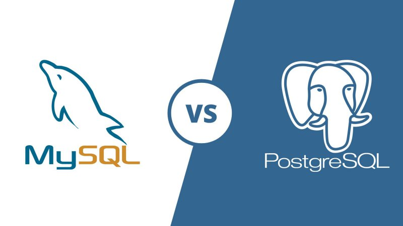
```

MySQL dan PostgreSQL, Keduanya menyimpan data di dalam tabel yang terkait satu sama lain melalui nilai kolom umum. Namun keduanya sering dibandingkan karena terdapat beberapa perbedaan. Ingin mengenal lebih dalam? Simak penjelasan di bawah.

### Kelebihan 

|MySQL |	PostgreSQL|
|:---------|:-----------|
|Integrasi bahasa pemrograman sangat luas; | Support framework website modern seperti Node.js dan Django; Support framework website modern seperti Node.js dan Django; |
|Aplikasi ringan, tidak membutuhkan spesifikasi hardware yang tinggi; | Dirilis dengan lisensi PostgreSQL sendiri; | 
|Struktur tabel dengan fleksibilitas tinggi; | Bersifat open source dan gratis; |
|Dibekali banyak administrative tools; | Skala besar, mampu memuat hingga ribuan transaksi data; | 
|Bersifat open source dan gratis (versi basic); | Memiliki banyak fitur yang mumpuni; | 
|Meski open source, MySQL menjamin keamanan tingkat tinggi; | Memiliki banyak fitur yang mumpuni; | 
|Mendukung berbagai variasi Data Type; | Performa sangat baik meski menuntut query yang lebih kompleks; |
|Dapat digunakan banyak pengguna karena mendukung multi user. | Kecepatan analisis (read-write) sangat cepat; Keamanan yang lebih ketat.|


### Kekurangan 

|MySQL |	PostgreSQL|
|:---------|:-----------|
|Sistem manajemen database kurang cocok untuk aplikasi mobile dan game;| PostgreSQL tidak mendukung semua stack development;|
|Technical support MySQL dinilai kurang baik;| Meski memiliki integrasi dan skalabilitas tinggi, kecepatan PostgreSQL kalah unggul dibandingkan RDBMS lain;|
|Sulit diaplikasikan untuk manajemen database berskala besar.| Sistem kompatibilitas PostgreSQL menuntut pengguna untuk bekerja lebih keras dalam perbaikan dan perawatan.|


## Instalasi MySQL (XAMPP)

### Download Aplikasi XAMPP 
 
Silakan [klik disini](https://www.apachefriends.org/download.html) untuk mengunduh applikasi XAMPP, pilih salah satu saja sesuai Operating System pada Komputer anda. 

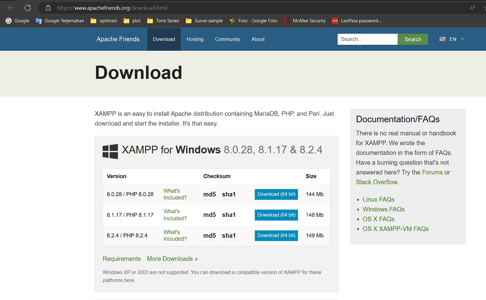 

### Install Aplikasi

Temukan file XAMPP.exe yang telah anda download, secara default biasanya disimpan di; 

 

Selanjutnya, akan muncul Warning di klik **OK**

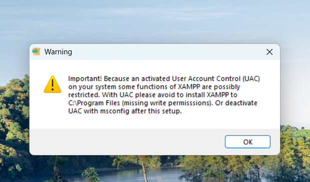 

selajutunya klik next 


Klik next lagi, karena sudah dipilih secara default oleh XAMPP

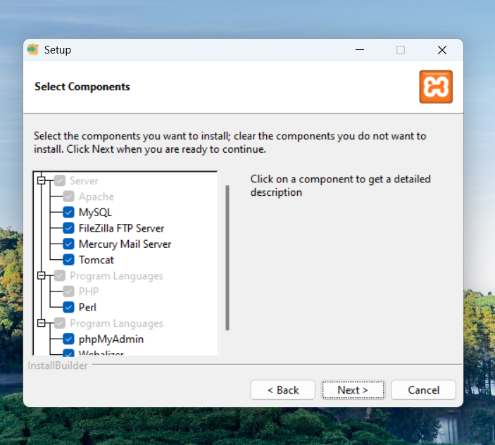


### Pilih Folder

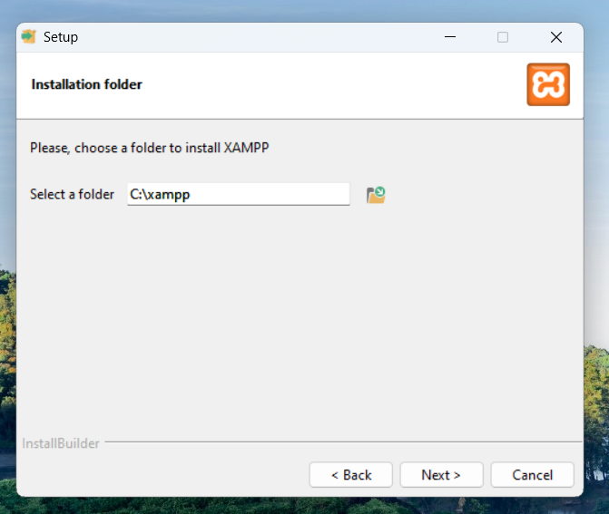 

Secara default akan membuat folder baru **C:&#92;xampp**, lalu pilih next.

**note:** jika anda sudah pernah mendownload aplikasi xampp, perlu di hapus terlebih dahulu file xampp yang lama di file **C:&#92;xampp**

### Jalankan proses Instalasi

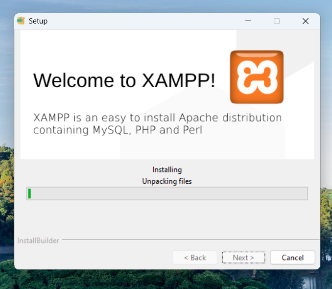 

Tunggu proses instalasi selesai **Biasanya 5-10 menit, tergantung kecepatan komputer anda**. 

### XAMPP sudah terinstall


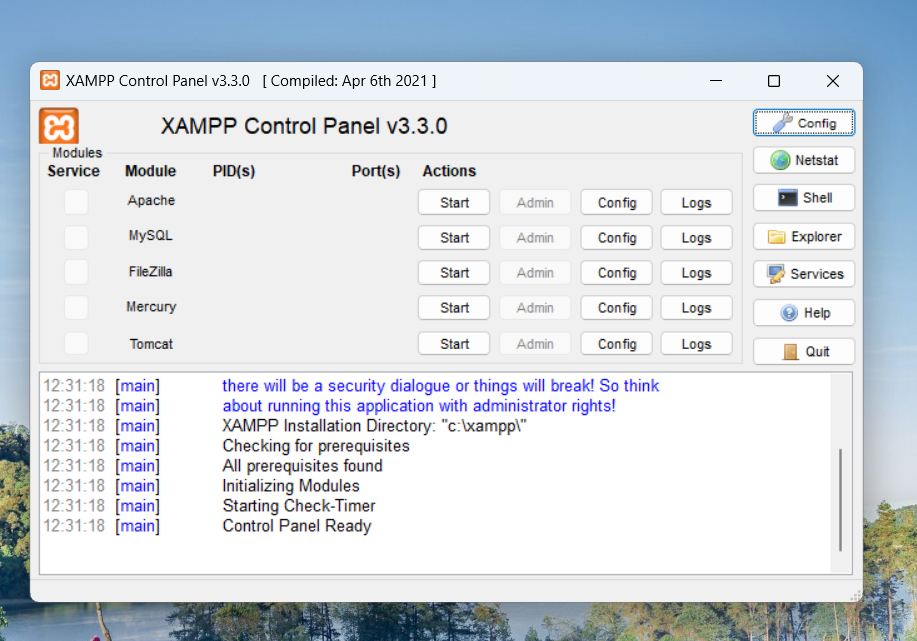 

Setelah aplikasi terinstall, sudah bisa digunakan.

### Video Instalasi XAMPP

<iframe width="800" height="540" src="https://www.youtube.com/embed/T6Up7HgFocs" title="YouTube video player" frameborder="0" allow="accelerometer; autoplay; clipboard-write; encrypted-media; gyroscope; picture-in-picture; web-share" allowfullscreen></iframe>


## Instalasi PostgreSQL

Berikut ini adalah proses langkah demi langkah tentang Cara Menginstal PostgreSQL di Windows:

### Buka Browser

Klik https://www.postgresql.org/download and pilih Windows

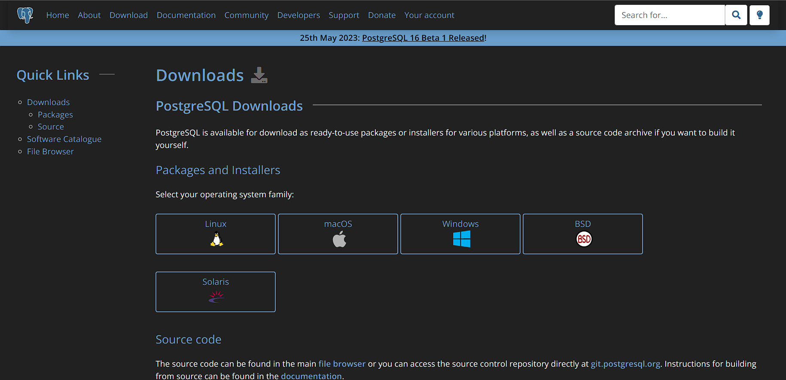


### Cek Option

Klik Download the installer Interactive Installer by EnterpriseDB

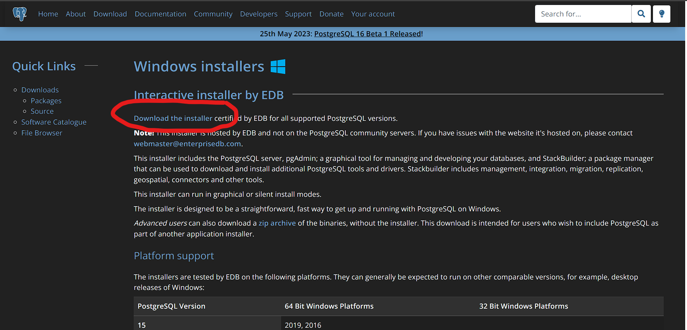


### Pilih PostgreSQL version

Anda akan diminta untuk memilih versi PostgreSQL dan sistem operasi yang diinginkan. Pilih versi PostgreSQL terbaru dan OS sesuai dengan environment Anda, **klik tombol download.**

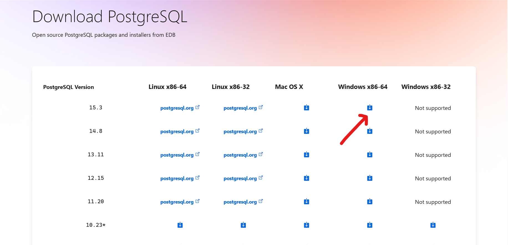


### Open exe file

Setelah Anda mengunduh PostgreSQL, buka exe yang telah diunduh dan Klik berikutnya pada layar install welcome screen.


### Pilih folder

Ubah direktori Instalasi jika diperlukan, jika tidak, biarkan default,  **klik Next.**


### Select components

Anda dapat memilih komponen yang ingin Anda instal di sistem Anda. Anda dapat menghapus centang pada Stack Builder (*disarankan ikuti secara default*), **klik Next.**

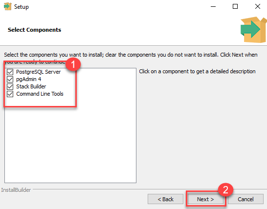


### Check data location

Anda dapat mengubah lokasi data, **Klik Next.**

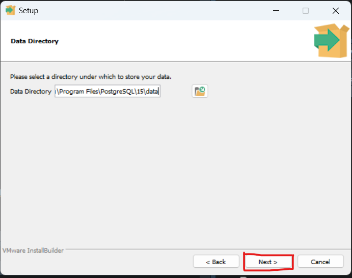

### Masukan Password

Masukkan kata sandi superuser. Catat kata sandi tersebut, **Klik Next.**


### Cek opsi port

Biarkan nomor port menjadi default, **Klik Next.** 


### Cek Summary

Periksa pra-penginstalan summary, **Klik Next**


### Ready to Install

Klik tombol Next 


### Check stack builder prompt

Setelah instalasi selesai, Anda akan melihat prompt Stack Builder. Hapus centang pada opsi tersebut. Kita akan menggunakan Stack Builder dalam tutorial selanjutnya, **Klik Finish.**

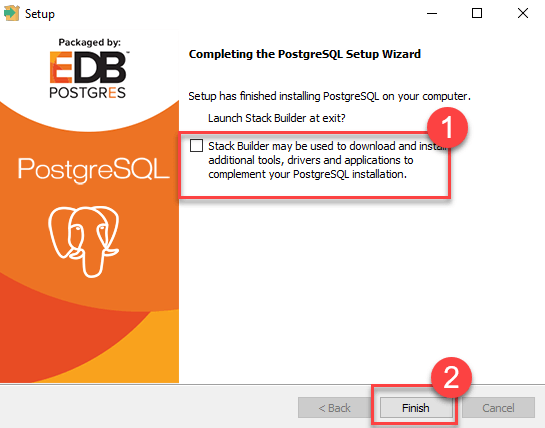

### Launch PostgreSQL

Untuk launch PostgreSQL, buka Start Menu dan cari pgAdmin 4

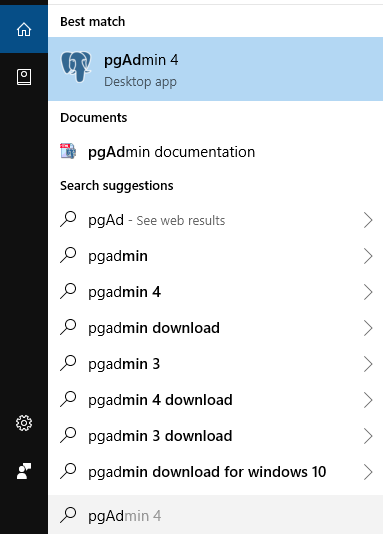

### Check pgAdmin

Anda akan melihat beranda pgAdmin

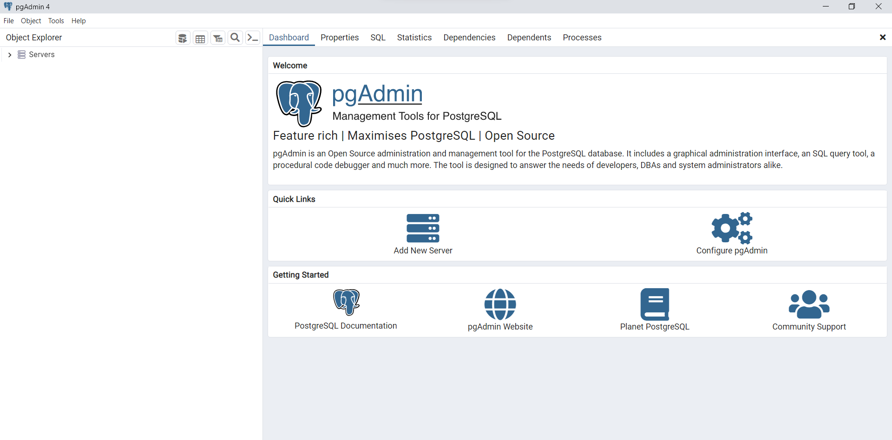

### Cari PostgreSQL 15

Klik pada Servers > PostgreSQL 15 di sub sebelah kiri

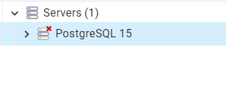

### Enter password

Masukkan kata sandi superuser yang ditetapkan selama instalasi, **Klik OK**


### Cek Dashboard

Anda akan melihat Dashboard


### Video Instalasi PostgreSQL

<iframe width="800" height="540" src="https://www.youtube.com/embed/0n41UTkOBb0" title="YouTube video player" frameborder="0" allow="accelerometer; autoplay; clipboard-write; encrypted-media; gyroscope; picture-in-picture; web-share" allowfullscreen></iframe>

* [Download PostgreSQL](https://www.postgresql.org/download/)


## Praktikal (Hands On)

Untuk memulai bagian ini, pastikan bahwa anda sudah meng-install Anaconda dan XAMPP dikomputer yang akan digunakan. Kemudian, bukalah applikasi Juperterlab yang ada pada layar Anaconda Navigator, seperti diperlihatkan sebagai berikut:

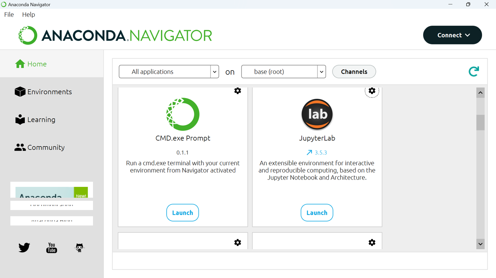

Selanjutnya, akan muncul halaman baru pada browser seperti gambar berikut;
 


Selanjutnya, klik `File > Open from URL'. Muncul tampilan sebagai berukut: 


Terakhir, Copy-Paste dibawah ini pada kolom `Open URL`. Selanjutnya, ikuti tutorialnya. 

* [**Akses Databases MySQL dengan Python**](https://raw.githubusercontent.com/dsciencelabs/JNE_Data_Analytics_PySQL/main/jupyterlab/01_py_sql.ipynb)

* [**Akses Databases PostgreSQL dengan Python**](https://raw.githubusercontent.com/dsciencelabs/JNE_Data_Analytics_PySQL/main/jupyterlab/01_py_postgresql.ipynb)

* [**Contoh Applikasi Sederhana Py_SQL**](https://raw.githubusercontent.com/dsciencelabs/JNE_Data_Analytics_PySQL/main/jupyterlab/01_Contoh_Aplikasi.ipynb)
 
## Latihan 
